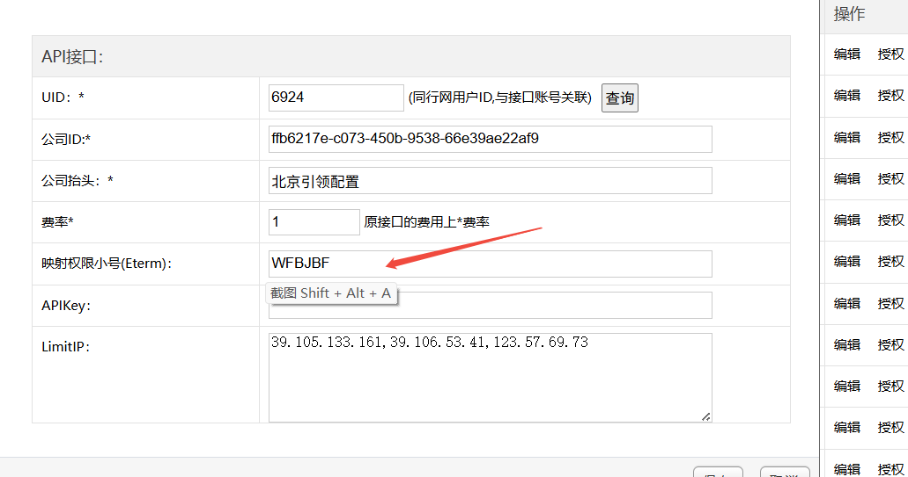

#后台 
### 1.外面访问我们的接口
##### 第一步：给他们注册一个用户
系统设置  - > API管理  ->  用户Token

这里我们需要一个员工ID，可以在  LinQpad  ->  代理人信息 中查到，将查询的位置改为：

token可以随便生成一个，也可以直接用他们的Guid，有效期可以填到2030年
##### 第二步：在IBEAPI接口接入情况中添加

配置开通IBE透传功能时，注意，需要加一下小号。后面，接口操作会用到。

### 2.我们访问外面的接口

