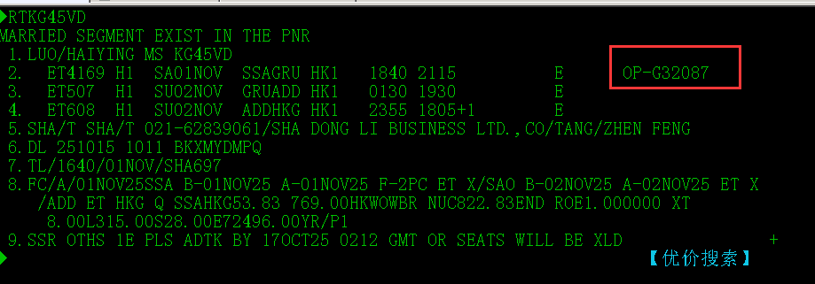

---
tags:
  - 后台
---

#### 支付端拦截-错误的联运协议
#### Q:
![[企业微信截图_17604996285801.png]]
KG45VD    ET和G3没有联运协议，麻烦帮后台维护支付端拦截

#### A:
代理可能错误的将没有联运协议的航司联运，而我们没有进行拦截，票开到航信处被航信拦截：如图2中的错误代码：
	其中IET为联运协议，该代码返回说明不存在联运协议
所以我们要在我们这进行拦截
配置拦截在：
	系统设置  ->  通用配置  ->  通用配置项管理  ->  搜索SPA  ->  393SPA无出票权设置
设置该配置项，注意格式为半角逗号分隔，航司对以半角冒号连接。
![[企业微信截图_1760501146926.png]]