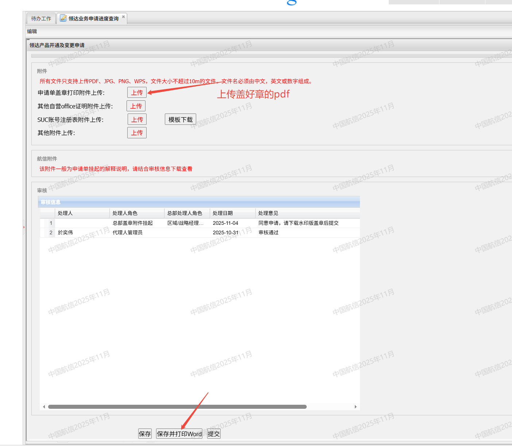

#航信网站
## 第一步：提交申请：
http://uwing.travelsky.com.cn/uwing/common/desktop!index.action
优翼网站，公司代码：SHA697，用户名：HDSHA697，密码：在230后台上。
登录进去后找到”领达产品申请“

申请界面如下：

一般不申请ndc(t系列)的话ip地址和ndc相关都填不变。
申请目的可以填：“因开展业务需要，申请开通/修改。。。”

改好要开通或变更的接口之后就可以提交了。然后等航信那边进行到下一步。

## 第二步：提交申请单
现在一般会给通知邮箱发个邮件，提醒你去提交申请单。

再来到“领达业务申请进度查询”

然后你需要提交的申请会有个“编辑”选项。

到最下面找到“保存并打印Word”下载带水印的word文档。
一般长这样：

不需要做任何修改直接打印。
找陈总签个字然后去佳姐那盖个商务的公章就可以了（记得发盖章工作流）

拿到盖好章的文件再转成pdf上传就可以了。

这个时候在业务管理能看到的审核信息大概是这样的：

## 第三步：申请完成
如果前面的步骤都没出问题的话，一般过个一段时间申请就通过了，同样的也会有邮件提醒：

没意外的话就是申请成功了，有意外的话就按照他申请情况里退回的备注改就可以了。
